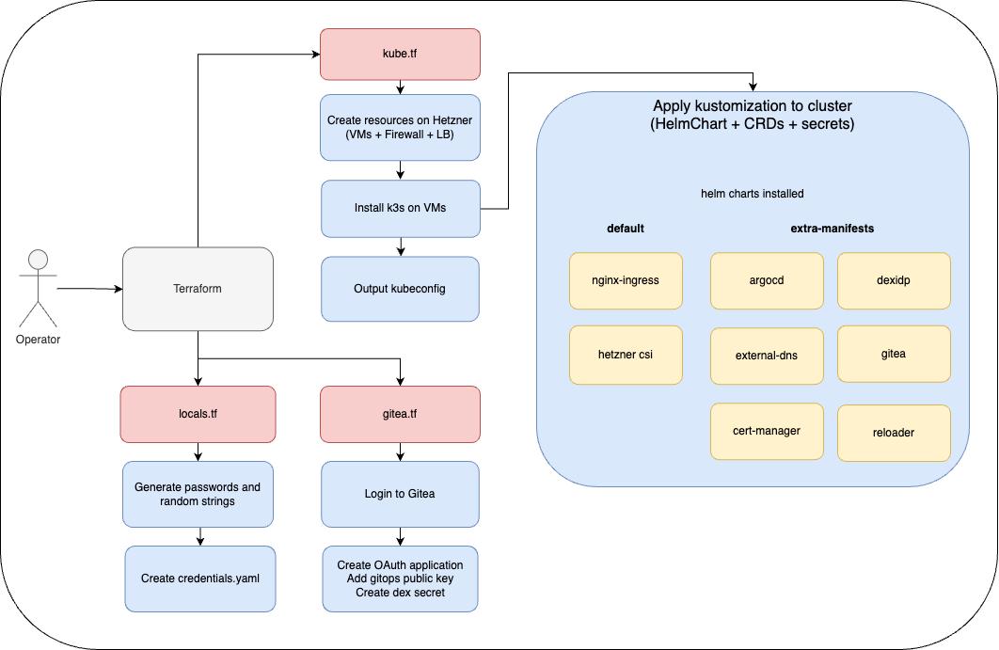

# kube-hetzner-argocd-playground

This project allows to create a k8s cluster on-demand with only basic GitOps services running on it, such as ArgoCD and Gitea. Any other tools/services could be added using the GitOps approach. You can use it as a template for your own cluster.

## Prerequisites
- Hetzner Cloud API token
- Cloudflare API token
- Domain name in Cloudflare for your cluster

## To create new cluster
1. Use `play` folder, or create new one, using it as a template
2. Create new snapshot of MicroOS image by running 
```bash
export HCLOUD_TOKEN="your_hcloud_token"
packer init hcloud-microos-snapshots.pkr.hcl
packer build hcloud-microos-snapshots.pkr.hcl
```
3. Create `.env` file based on [.env.example](./play/.env.example) with snapshot IDs and credentials
4. Source the `.env` file to load environment variables:
```bash
source .env
```
5. To create hetzner resources and deploy k3s on them, run couple of times if needed (it can **fail 1st time** due to CRDs not being ready):
```bash
terraform apply --target=module.kube-hetzner
```
6. Wait for k3s to be ready and DNS to be propagated and to configure Gitea, ArgoCD, Dex, run what's left:
```bash
terraform apply
```


## To access cluster
All credentials and urls for services can be found in `play_credentials.yaml` file, which is created after `terraform apply` command. Kubeconfig is outputed as `play_kubeconfig.yaml` file.

In order to fast and easy access you can export it to your shell:
```bash
export KUBECONFIG=$(pwd)/play_kubeconfig.yaml
```

## First Helm chart deployment
As you first helm chart it's better to use something simple, like [hello world](https://artifacthub.io/packages/helm/cloudecho/hello) app. Commit following files to your `gitops` repository:
 
`hello/Chart.yaml`
```yaml
apiVersion: v2
name: hello
version: 0.0.0
dependencies:
  - name: hello
    version: 0.1.2
    repository: https://cloudecho.github.io/charts/
```

`hello/values.yaml`
```yaml
hello:
  replicaCount: 2
```


## Architecture

Terraform creates resources on Hetzner, which are used to run [k3s](https://docs.k3s.io/). Then k3s is used to deploy [ArgoCD](https://argo-cd.readthedocs.io/en/stable/), [Gitea](https://gitea.io/) and [Dex](https://dexidp.io/). To deploy those helm charts Terraform uses [HelmChart](https://github.com/rancher/helm-controller) resource.

Terraform does the following extra:
- creates in Gitea new repository named `gitops`, which is monitored by ArgoCD
- creates webhook in Gitea to trigger ArgoCD sync on any push to `gitops` repository
- uploads public key to Gitea to allow ArgoCD and **you** to access it, using SSH
- configures Dex to use Gitea as OAuth2 provider, so **you** can access ArgoCD using Gitea credentials

### Diagram of Terraform resources

_diagram can be edited using [draw.io](https://app.diagrams.net/)_

### Diagram of Hetzner Cloud resources created by Terraform

_diagram can be edited using [draw.io](https://app.diagrams.net/)_

## Maintainance
TL;DR; Use https://github.com/kube-hetzner/terraform-hcloud-kube-hetzner


## Attributions and my comments

Thanks to [kube-hetzner](https://github.com/kube-hetzner/terraform-hcloud-kube-hetzner) for inspiration and for the module itself.

I think it's a great setup to start with if you want to create ready to use cluster, but I would recommend to do those things for production:
- do not use Gitea as a primary authentication provider, use something like [Keycloak](https://www.keycloak.org/) or [Authelia](https://www.authelia.com/)
- do not use Gitea as gitops repository, use something like Github or Gitlab (main problem is that gitops remains in cluster which it tries to configure)
- do it highly-available
- do not use flannel as a CNI, I think Calico is better choice