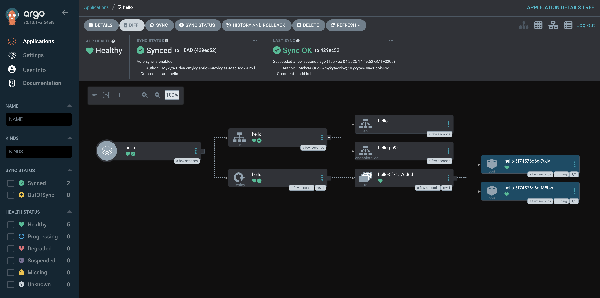
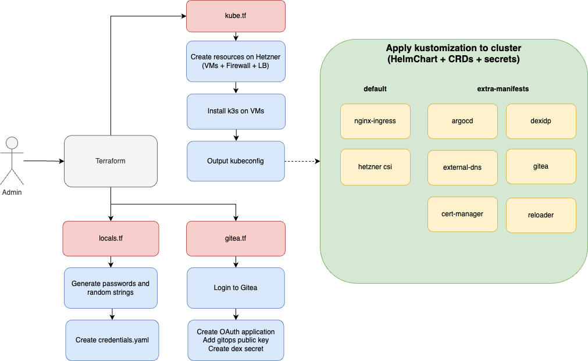
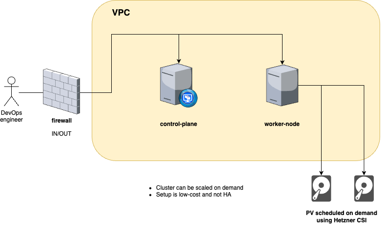

# kube-hetzner-argocd-playground

This project allows to create a k8s cluster on-demand with only basic GitOps services running on it, such as ArgoCD and Gitea. Any other tools/services should be added using the GitOps approach.

## Prerequisites
- Hetzner Cloud API token
- Cloudflare API token
- Domain name configured in Cloudflare

## Creating new cluster
To create new cluster:
1. Use `play` folder, or create new one, using it as a template
2. Create new snapshot of MicroOS image by running 
```bash
export HCLOUD_TOKEN="your_hcloud_token"
packer init hcloud-microos-snapshots.pkr.hcl
packer build hcloud-microos-snapshots.pkr.hcl
```
3. Replace all needed values in header of `locals.tf` file, including snapshot ID of MicroOS image
4. Create `.env` file with credentials based on `.env.example` file
5. Run `terraform apply --target=module.kube-hetzner` to create hetzner resources and deploy k3s on them (it can **fail 1st time** due to CRDs not being ready), run couple of times if needed
6. Wait for k3s to be ready and DNS to be propagated and run `terraform apply` to configure Gitea, ArgoCD, Dex


### Accessing cluster
All credentials for services can be found in `play_credentials.yaml` file. Kubeconfig is outputed as `play_kubeconfig.yaml` file.

In order to fast and easy access you can export it to your shell:
```bash
export KUBECONFIG=$(pwd)/play_kubeconfig.yaml
```

### Example helm chart
As you first helm chart it's better to use something simple, like [hello world](https://artifacthub.io/packages/helm/cloudecho/hello) app. Commit following files to your `gitops` repository:
 
`hello/Chart.yaml`
```yaml
apiVersion: v2
name: hello
version: 0.0.0
dependencies:
  - name: hello
    version: 0.1.2
    repository: https://cloudecho.github.io/charts/
```

`hello/values.yaml`
```yaml
hello:
  replicaCount: 2
```



## Architecture

Terraform creates resources on Hetzner, which are used to run [k3s](https://docs.k3s.io/). Then k3s is used to run ArgoCD, Gitea and Dex. During apply Terraform creates in Gitea new repository named `gitops`, which is monitored by ArgoCD, also it creates webhook in Gitea to trigger ArgoCD sync on push and upload [public key](./play/play_gitea.pem) to Gitea to allow ArgoCD and **you** to access it. Dex is configured to use Gitea as OAuth2 provider.



_diagram can be edited using [draw.io](https://app.diagrams.net/)_

### Hetzner Cloud

Diagram of Hetzner Cloud resources created by Terraform

_diagram can be edited using [draw.io](https://app.diagrams.net/)_

## Maintainance
TL;DR; Use https://github.com/kube-hetzner/terraform-hcloud-kube-hetzner

### Packer
On first run new image is created from file `hcloud-microos-snapshots.pkr.hcl` and then it is used to create new VMs. Usually it is enough to run `packer build hcloud-microos-snapshots.pkr.hcl` to create new image.
